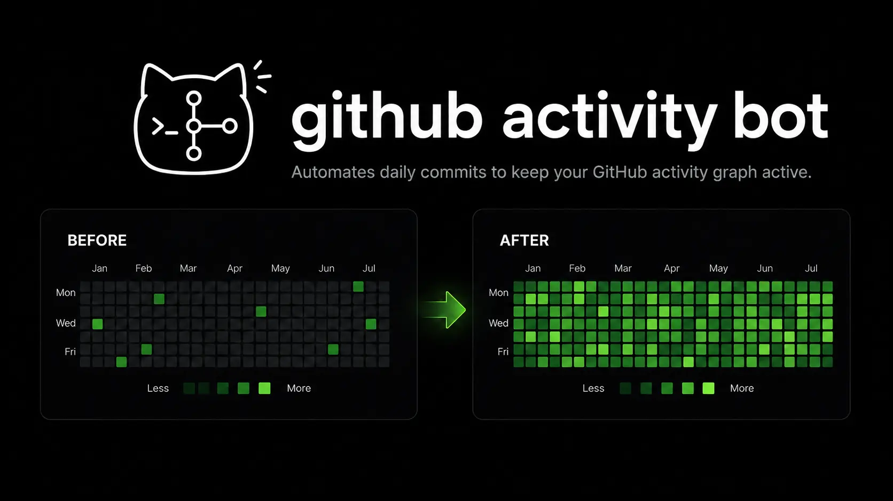

<p align="center">
  
</p>

<p align="center">Keeps your GitHub contribution graph green, automatically, on Linux, macOS and Windows.</p>

<p align="center">
  <a href="https://github.com/Bedohly/github-activity-bot/actions/workflows/ci.yml"></a>
  
  
  
  
</p>

> **This is a teaching project.** It fills your contribution graph with activity
> that is not real work, and anyone who clicks a green square will see that.
> Use it at your own risk — your account, your call — and only on a repository
> you own. Please stay inside [GitHub's Acceptable Use Policies](https://docs.github.com/site-policy/acceptable-use-policies/github-acceptable-use-policies).

---

## What it does

You point it at one repository you own. Every day it adds a few small commits
to a log file in that repository, at random times, on random days — so your
contribution graph fills in on its own.

- **Pick how busy it looks.** Four presets, from barely-there to obvious.
- **It starts slow.** The default preset begins almost silent and works up to
  its normal pace over a month, instead of switching on at full blast.
- **Set it once.** It installs a daily task and you never think about it again.
- **Nothing to install but Python.** No packages, no accounts, no services.

## Install

**Linux / macOS**

```bash
git clone https://github.com/Bedohly/github-activity-bot.git
cd github-activity-bot
./install.sh
```

**Windows**

```powershell
git clone https://github.com/Bedohly/github-activity-bot.git
cd github-activity-bot
powershell -ExecutionPolicy Bypass -File .\install.ps1
```

You need [Python](https://www.python.org/downloads/) 3.8 or newer and
[git](https://git-scm.com/downloads). The installer checks for both and tells
you if something is missing.

## First run

Type `autocommit` and press enter. You get a panel showing where things stand,
and a prompt:

```
╭────────────────────────────────────────────────────────────╮
│  AUTOCOMMIT                                        v1.3.0  │
╰────────────────────────────────────────────────────────────╯
  account      ● bedohly  (github cli)
  repository   ● bedohly/activity-log  branch main
  profile      ● starter  warming up, day 6 of 30 (20%)
  cadence        1-2 commits/day · weekdays 45% · weekends 15%
  schedule     ● daily 20:00 (+90m)
  last run     ● today · 2 commits · pushed

autocommit ›
```

Then type `/setup`. It walks you through four questions:

1. **Sign in.** Paste a GitHub token, or let it reuse the
   [GitHub CLI](https://cli.github.com) login if you already have one.
2. **Pick a repository.** It lists yours, or makes you a fresh one.
3. **Pick how busy it should look.** See below.
4. **Schedule it.** Choose a time; it handles the rest.

That's it. It runs itself from then on.

## How busy should it look?

| Profile | What you get | Ramp-up |
|---|---|---|
| **starter** *(default)* | 1–2 commits, about half of weekdays, rarely weekends | Almost silent at first, normal pace after 30 days |
| **casual** | 1–3 commits, most weekdays | 14 days |
| **steady** | 1–4 commits, nearly every weekday, plus the odd issue and pull request | 7 days |
| **heavy** | 2–8 commits every single day, issues and pull requests too | None — full speed immediately |

```bash
autocommit profile           # see them all
autocommit profile casual    # switch
```

Or `/profile` in the console.

**A word on the ramp.** `starter` doesn't jump straight to its full rate. It
begins at roughly a third of it and grows over the first month, because a graph
that goes from empty to busy overnight looks exactly like what it is. That said,
no setting makes this undetectable — the commits are one-line edits to a log
file, and anyone who opens one can tell. Low and slow is quieter mainly because
it is genuinely *less*.

## Everyday commands

You mostly won't need these, but:

| | |
|---|---|
| `autocommit` | Open the console |
| `autocommit status` | Is it working? When did it last run? |
| `autocommit run` | Do today's commits right now |
| `autocommit run --dry-run --days 30` | Show what a month would look like, change nothing |
| `autocommit profile casual` | Change how busy it looks |
| `autocommit schedule --at 20:00` | Change the daily time |
| `autocommit schedule --remove` | Stop it |

Inside the console the same things are `/status`, `/run`, `/plan 30`,
`/profile`, `/schedule`, `/unschedule`. Type `/help` to see everything.

## Will the squares actually turn green?

Usually yes. If they don't, run `autocommit check` — it tests each of these and
tells you which one failed:

- The repository is **yours** and **not a fork** (commits in forks never count).
- Commits land on the repository's **default branch**.
- The commit email is **linked to your account** (it uses your GitHub noreply
  address by default, which always is).
- If the repository is **private**, you enabled *Include private contributions
  on my profile* in your GitHub profile settings.

The graph is also cached, so give it a few minutes.

## Issues and pull requests

The graph counts more than commits: opened issues, opened pull requests and
reviews all show up. The `steady` and `heavy` profiles turn this on, or:

```bash
autocommit activity --dry-run    # see what a round would do
```

It branches, commits, opens a pull request, reviews it, merges it, and opens a
couple of issues. **Only in repositories you own** — the tool refuses anything
else, because automated issues in someone else's project are spam.

Two honest limits: issues and pull requests are stamped when they're created,
so unlike commits they can't be backdated. And GitHub won't let you approve
your own pull request, so reviews go in as comments, which may not count at
all. Commits are the reliable part.

## Everything else

Full command list, every setting, how scheduling works on each platform, where
files live, and how to run the tests: **[docs/REFERENCE.md](docs/REFERENCE.md)**.

## License

MIT — see [LICENSE](LICENSE). Do what you like with it.
